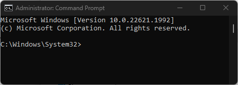

# What is this?

This is a collection of batch (bat?) scripts that makes my life easier when re-installing Windows.

| Script       | Description    |
|--------------|----------------|
| [winget](winget/README.md)    | Downloads a collection of applications that I find useful. |
| [winset](winset/README.md)    | Sets regedit values that I find useful (dark mode, hide activation watermark, etc) |

# How do I run this?

1) Run cmd.exe as administrator. Make sure the window says "Administrator: Command Prompt", like this:

2) Run all batch scripts listed in table above:
 `winstreamline.bat`

3) Reboot computer (some scripts may require this)

# Why batch scripts?

Powershell is useful and Python is cool and very flexible.. but where is the challenge in that?
There is something beautiful with writing scripts with overly complex syntax and 
unintuative parsing. It makes me feel comfortable and cozy inside. Like listening to rain falling on tin roof.

No just kidding. Batch scripts are always included in Microsoft Windows installations by default.
That's the reason behind currently only using batch scripts. 
It is possible to add dependencies in other script languages because of `winget`'s package download ability.
